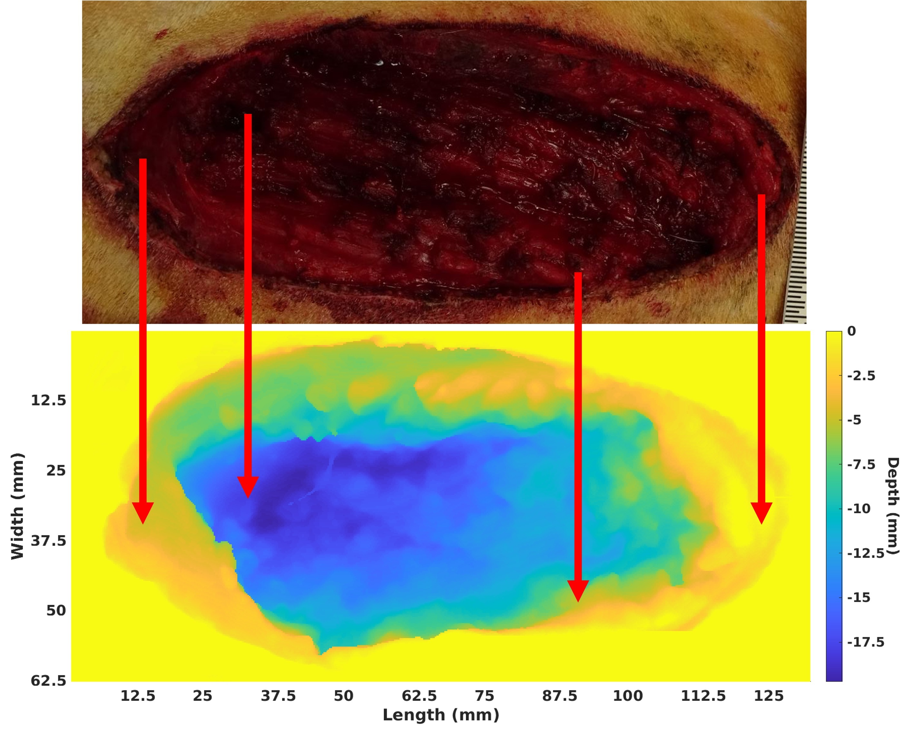
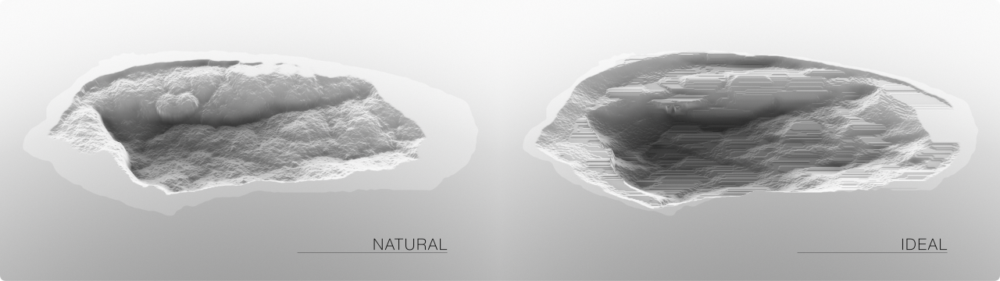

<h5>Volumetric Muscle Loss injury is a debilitating injury marked by significant loss of functionality in affected tissues. The Regenerative Electronic Platform through Advanced Intelligent Regulation (REPAIR) project aims to enhance the regrowth of functional muscle through an AI agent trained with a high-resolution simulation model (the Wound Environment Agent-based Model or WEABM) that recieves input regarding the spatially discrete molecular state of the wound and determines the activation of cell factories engineered to produce a set of pro-, anti-inflammatory cytokines, growth factors and anti-fibrotic agents. This overall structure is compliant with the definition of a Digital Twin as per the National Academies of Sciences, Engineering and Medicine report from 2024. </h5>

Overall schematic of REPAIR System

High Resolution Rendering of Wound Environment Agent-Based Model (WEABM)

Mapping between experimental surgical wound and heatmap representation of WEABM (heatmap of wound depth)

Comparison between native healing with fibrosis (left) and idealized effective control with myogenesis (right). Note that the idealized effective control results in linear regrowth of muscle fibers

<a href="https://www.biorxiv.org/content/10.1101/2024.06.04.595972v2/">Preprint Summmarizing the Wound Environment Agent-based Model (WEABM): High resolution simulation model of VML</a>

Cockrell C., Vodovotz Y., Zamora R. and An, G. "The Wound Environment Agent-based Model (WEABM): a digital twin platform for characterization and complex therapeutic discovery for volumetric muscle loss." 6 June 2024. bioRxiv: 2024.2006.2004.595972. doi: https://doi.org/10.1101/2024.06.04.595972

<a href="https://pubmed.ncbi.nlm.nih.gov/36039923/">Publication on underlying biology</a>

Crum, R.J., Johnson, S.A., Jiang, P., Jui, J.H., Zamora, R., Cortes, D., Kulkarni, M., Prabahar, A., 
Bolin, J., Gann, E. and Elster, E., 2022. Transcriptomic, Proteomic, and Morphologic 
Characterization of Healing in Volumetric Muscle Loss. Tissue Engineering Part A, 28(23-24), 
pp.941-957.
